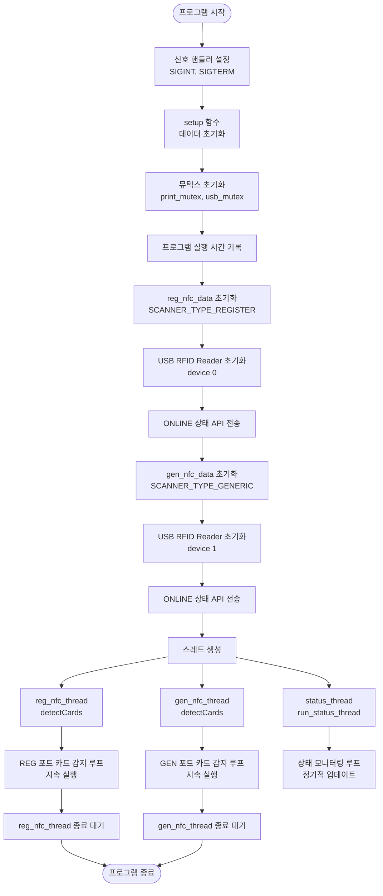
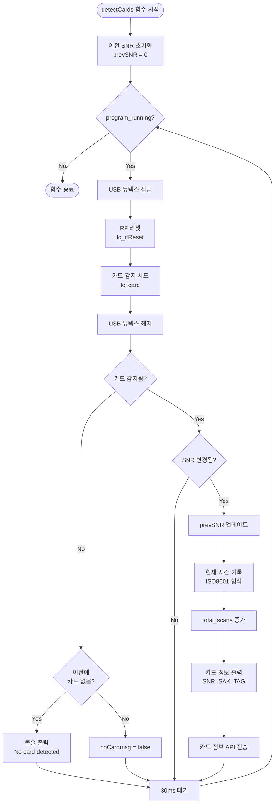
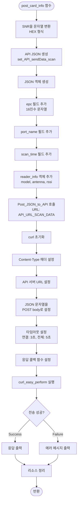
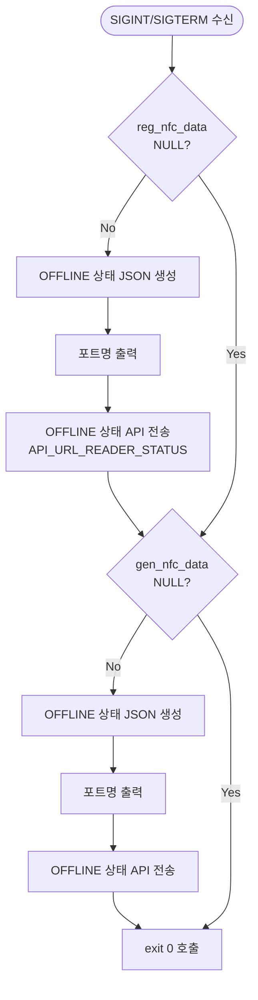
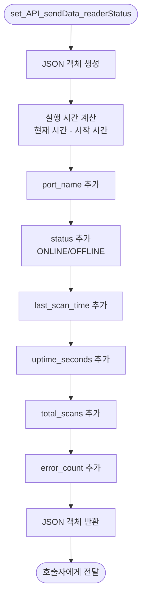
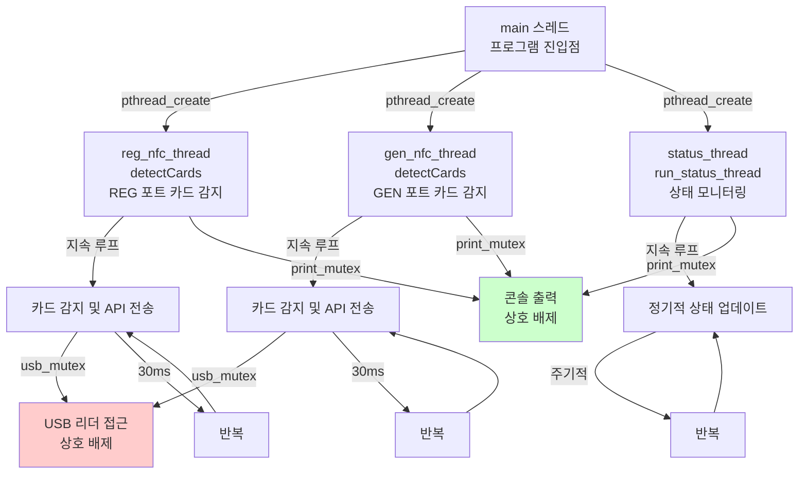
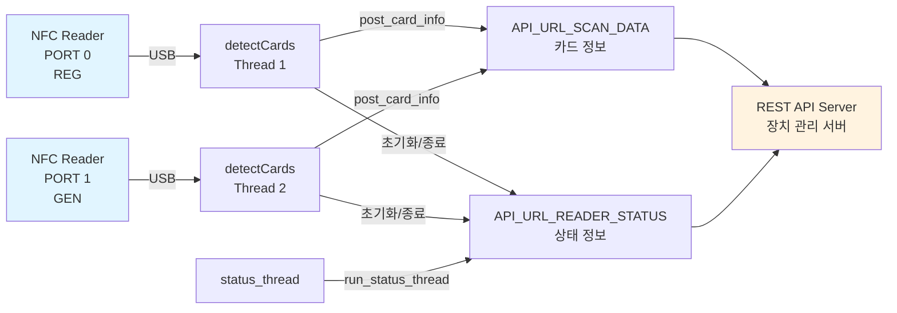

# NFC Reader Scanner 프로그램 플로우 차트

## 전체 프로그램 플로우

```mermaid
flowchart TD
    Start([프로그램 시작]) --> SignalSetup["신호 핸들러 설정<br/>SIGINT, SIGTERM"]
    SignalSetup --> InitData["setup 함수<br/>데이터 초기화"]
    
    InitData --> InitMutex["뮤텍스 초기화<br/>print_mutex, usb_mutex"]
    InitMutex --> InitUptime["프로그램 실행 시간 기록"]
    InitUptime --> InitScanner1["reg_nfc_data 초기화<br/>SCANNER_TYPE_REGISTER"]
    InitScanner1 --> UsbInit1["USB RFID Reader 초기화<br/>device 0"]
    UsbInit1 --> OnlineStatus1["ONLINE 상태 API 전송"]
    OnlineStatus1 --> InitScanner2["gen_nfc_data 초기화<br/>SCANNER_TYPE_GENERIC"]
    InitScanner2 --> UsbInit2["USB RFID Reader 초기화<br/>device 1"]
    UsbInit2 --> OnlineStatus2["ONLINE 상태 API 전송"]
    
    OnlineStatus2 --> ThreadCreate["스레드 생성"]
    ThreadCreate --> RegThread["reg_nfc_thread<br/>detectCards"]
    ThreadCreate --> GenThread["gen_nfc_thread<br/>detectCards"]
    ThreadCreate --> StatusThread["status_thread<br/>run_status_thread"]
    
    RegThread --> RegLoop["REG 포트 카드 감지 루프<br/>지속 실행"]
    GenThread --> GenLoop["GEN 포트 카드 감지 루프<br/>지속 실행"]
    StatusThread --> StatusLoop["상태 모니터링 루프<br/>정기적 업데이트"]
    
    RegLoop --> Wait1["reg_nfc_thread 종료 대기"]
    GenLoop --> Wait2["gen_nfc_thread 종료 대기"]
    
    Wait1 --> End([프로그램 종료])
    Wait2 --> End
```

## 카드 감지 (detectCards) 함수 상세 플로우

```mermaid
flowchart TD
    Start([detectCards 함수 시작]) --> Init["이전 SNR 초기화<br/>prevSNR = 0"]
    Init --> Loop{"program_running?"}
    
    Loop -->|No| Exit([함수 종료])
    Loop -->|Yes| Lock["USB 뮤텍스 잠금"]
    
    Lock --> Reset["RF 리셋<br/>lc_rfReset"]
    Reset --> Card["카드 감지 시도<br/>lc_card"]
    Card --> Unlock["USB 뮤텍스 해제"]
    
    Unlock --> CardCheck{"카드 감지됨?"}
    CardCheck -->|No| NoCard{"이전에<br/>카드 없음?"}
    NoCard -->|Yes| Print1["콘솔 출력<br/>No card detected"]
    Print1 --> Sleep1["30ms 대기"]
    
    NoCard -->|No| SetFalse["noCardmsg = false"]
    SetFalse --> Sleep1
    
    CardCheck -->|Yes| SNRCheck{"SNR 변경됨?"}
    SNRCheck -->|No| Sleep1
    
    SNRCheck -->|Yes| UpdateSNR["prevSNR 업데이트"]
    UpdateSNR --> UpdateTime["현재 시간 기록<br/>ISO8601 형식"]
    UpdateTime --> IncrCount["total_scans 증가"]
    IncrCount --> PrintCard["카드 정보 출력<br/>SNR, SAK, TAG"]
    PrintCard --> PostAPI["카드 정보 API 전송"]
    PostAPI --> Sleep1
    
    Sleep1 --> Loop
```

## 카드 정보 POST 플로우

```mermaid
flowchart TD
    Start([post_card_info 함수]) --> SNRStr["SNR을 문자열 변환<br/>HEX 형식"]
    SNRStr --> SetAPI["API JSON 생성<br/>set_API_sendData_scan"]
    
    SetAPI --> CreateJSON["JSON 객체 생성"]
    CreateJSON --> AddEPC["epc 필드 추가<br/>16진수 문자열"]
    AddEPC --> AddPort["port_name 필드 추가"]
    AddPort --> AddTime["scan_time 필드 추가"]
    AddTime --> AddReader["reader_info 객체 추가<br/>model, antenna, rssi"]
    
    AddReader --> PostJSON["Post_JSON_to_API 호출<br/>URL: API_URL_SCAN_DATA"]
    
    PostJSON --> CurlInit["curl 초기화"]
    CurlInit --> Headers["Content-Type 헤더 설정"]
    Headers --> SetURL["API 서버 URL 설정"]
    SetURL --> SetPostData["JSON 문자열을<br/>POST body로 설정"]
    SetPostData --> SetTimeout["타임아웃 설정<br/>연결: 3초, 전체: 5초"]
    SetTimeout --> SetCallback["응답 콜백 함수 설정"]
    SetCallback --> Perform["curl_easy_perform 실행"]
    
    Perform --> CheckResult{"전송 성공?"}
    CheckResult -->|Success| PrintResp["응답 출력"]
    PrintResp --> Cleanup["리소스 정리"]
    
    CheckResult -->|Failure| PrintErr["에러 메시지 출력"]
    PrintErr --> Cleanup
    
    Cleanup --> End([반환])
```

## 프로그램 종료 (Signal Handler) 플로우

```mermaid
flowchart TD
    Start([SIGINT/SIGTERM 수신]) --> Check1{"reg_nfc_data<br/>NULL?"}
    
    Check1 -->|No| CreateJSON1["OFFLINE 상태 JSON 생성"]
    CreateJSON1 --> PrintPort1["포트명 출력"]
    PrintPort1 --> SendStatus1["OFFLINE 상태 API 전송<br/>API_URL_READER_STATUS"]
    SendStatus1 --> Check2{"gen_nfc_data<br/>NULL?"}
    
    Check1 -->|Yes| Check2
    
    Check2 -->|No| CreateJSON2["OFFLINE 상태 JSON 생성"]
    CreateJSON2 --> PrintPort2["포트명 출력"]
    PrintPort2 --> SendStatus2["OFFLINE 상태 API 전송"]
    SendStatus2 --> Exit["exit 0 호출"]
    
    Check2 -->|Yes| Exit
```

## 상태 정보 API 플로우

```mermaid
flowchart TD
    Start([set_API_sendData_readerStatus]) --> CreateJSON["JSON 객체 생성"]
    
    CreateJSON --> GetUptime["실행 시간 계산<br/>현재 시간 - 시작 시간"]
    GetUptime --> AddPort["port_name 추가"]
    AddPort --> AddStatus["status 추가<br/>ONLINE/OFFLINE"]
    AddStatus --> AddLastTime["last_scan_time 추가"]
    AddLastTime --> AddUptime["uptime_seconds 추가"]
    AddUptime --> AddScans["total_scans 추가"]
    AddScans --> AddErrors["error_count 추가"]
    
    AddErrors --> Return["JSON 객체 반환"]
    Return --> End([호출자에게 전달])
```

## 멀티 스레드 구조

```mermaid
graph TD
    Main["main 스레드<br/>프로그램 진입점"]
    
    Main -->|pthread_create| Reg["reg_nfc_thread<br/>detectCards<br/>REG 포트 카드 감지"]
    Main -->|pthread_create| Gen["gen_nfc_thread<br/>detectCards<br/>GEN 포트 카드 감지"]
    Main -->|pthread_create| Status["status_thread<br/>run_status_thread<br/>상태 모니터링"]
    
    Reg -->|지속 루프| RegDetect["카드 감지 및 API 전송"]
    Gen -->|지속 루프| GenDetect["카드 감지 및 API 전송"]
    Status -->|지속 루프| StatusCheck["정기적 상태 업데이트"]
    
    RegDetect -->|usb_mutex| USB["USB 리더 접근<br/>상호 배제"]
    GenDetect -->|usb_mutex| USB
    
    Reg -->|print_mutex| Print["콘솔 출력<br/>상호 배제"]
    Gen -->|print_mutex| Print
    Status -->|print_mutex| Print
    
    RegDetect -->|30ms| Loop1["반복"]
    GenDetect -->|30ms| Loop2["반복"]
    StatusCheck -->|주기적| Loop3["반복"]
    
    Loop1 --> RegDetect
    Loop2 --> GenDetect
    Loop3 --> StatusCheck
    
    style USB fill:#ffcccc
    style Print fill:#ccffcc
```

## API 통신 아키텍처

```mermaid
flowchart LR
    Reader1["NFC Reader<br/>PORT 0<br/>REG"]
    Reader2["NFC Reader<br/>PORT 1<br/>GEN"]
    
    Reader1 -->|USB| Detect1["detectCards<br/>Thread 1"]
    Reader2 -->|USB| Detect2["detectCards<br/>Thread 2"]
    
    Detect1 -->|post_card_info| API1["API_URL_SCAN_DATA<br/>카드 정보"]
    Detect2 -->|post_card_info| API1
    
    Detect1 -->|초기화/종료| API2["API_URL_READER_STATUS<br/>상태 정보"]
    Detect2 -->|초기화/종료| API2
    
    Status["status_thread"] -->|run_status_thread| API2
    
    API1 --> Server["REST API Server<br/>장치 관리 서버"]
    API2 --> Server
    
    style Reader1 fill:#e1f5ff
    style Reader2 fill:#e1f5ff
    style Server fill:#fff3e0
```
