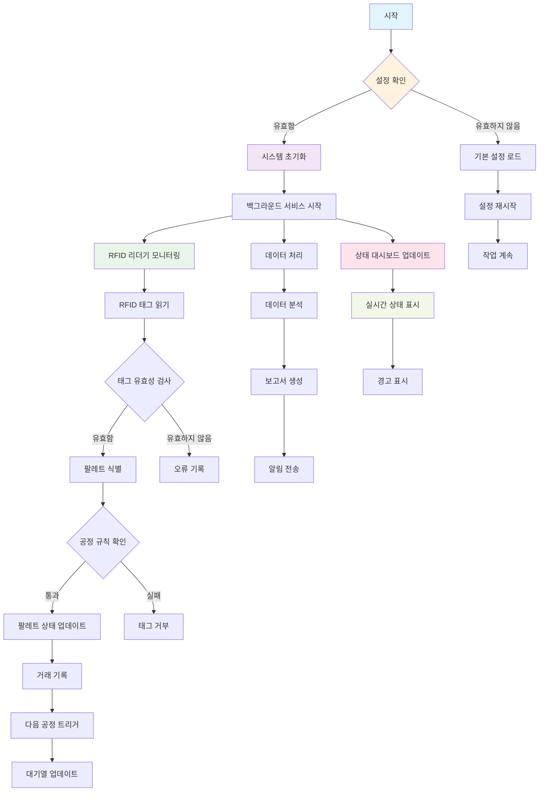

```mermaid
flowchart TD
    A[시작] --> B{설정 확인}
    B -->|유효함| C[시스템 초기화]
    B -->|유효하지 않음| D[기본 설정 로드]
    
    C --> E[백그라운드 서비스 시작]
    E --> F[RFID 리더기 모니터링]
    E --> G[데이터 처리]
    E --> H[상태 대시보드 업데이트]
    
    F --> I[RFID 태그 읽기]
    I --> J{태그 유효성 검사}
    J -->|유효함| K[팔레트 식별]
    J -->|유효하지 않음| L[오류 기록]
    
    K --> M{공정 규칙 확인}
    M -->|통과| N[팔레트 상태 업데이트]
    M -->|실패| O[태그 거부]
    
    N --> P[거래 기록]
    P --> Q[다음 공정 트리거]
    Q --> R[대기열 업데이트]
    
    G --> S[데이터 분석]
    S --> T[보고서 생성]
    T --> U[알림 전송]
    
    H --> V[실시간 상태 표시]
    V --> W[경고 표시]
    
    D --> X[설정 재시작]
    X --> Y[작업 계속]
    
    style A fill:#e1f5fe
    style B fill:#fff3e0
    style C fill:#f3e5f5
    style F fill:#e8f5e8
    style H fill:#fce4ec
    style V fill:#f1f8e9
```